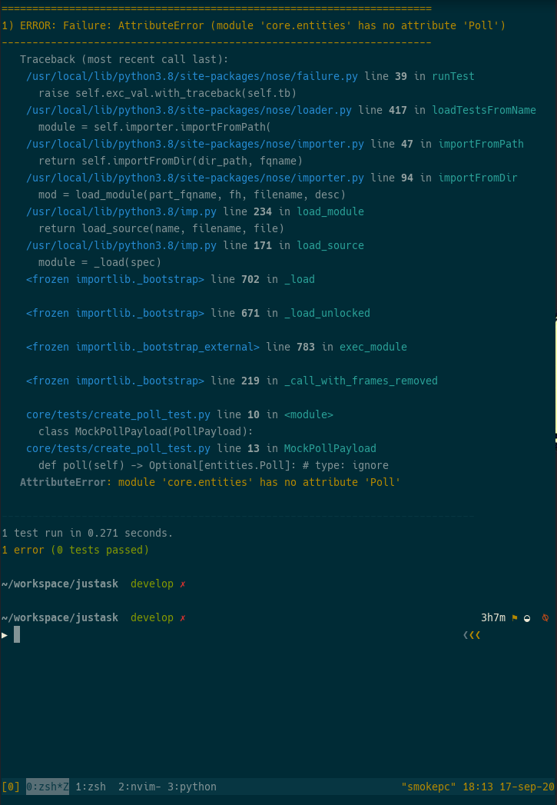

# justask
Esto es una evaluacion tecnica de Nubi,


Podes revisar toda la [documentacion](docs/README.md) relacionada al planeamiento y los objetivos de este proyecto.

## Instalar proyecto
Teniendo instaldo docker-compose en tu sistema operativo solo necesitas
correr el tipico comando `docker-compose up -d` y todas las dependencias
necesarias del sistema se instalaran automaticamente en sus respectivos
contenedores sin pasos adicionales

## Correr la bateria de pruebas
... jeje bateria (dos test tiene y ninguno funciona), para esto vinimo ? no
hubieramo quedado en kaza... haa cierto no salgo de mi casa desde hace mas de
semestre.

ok el modo recomendado de correr el testing es el siguiente:
```
docker-compose exec app nosetests --rednose
```

si hiciste todo bien...vas a obtener un flamante listado de errores como este
que ves aca:

 .
