# JustAsk

Es un proyecto de evaluación técnica. Se trata de un sistema de encuestas, **la
idea principal es que dicho sistema cuente con la menor cantidad de
restricciones posibles para el usuario final**. Debe ser capaz de generar,
explorar y expandir encuestas tanto en un medio de usuarios abierto como cerrado.

Los requerimientos de la evaluación cuentan con 8 casos de uso y 3
restricciones. Vamos a etiquetar con [CU] para *C*asos de *U*so y [R] para las
*R*estricciones.

## Vamos a verlos !

**\#1** [CU] Cuando creo una pregunta quiero tener una o mas respuestas como opción
**\#2** [R] Quiero que cada pregunta pueda tener como máximo 4 respuestas posibles
**\#3** [R] Quiero que pueda tener un sistema de autentificacion de usuarios
**\#4** [CU] Quiero que los que visitan una encuesta (no necesiten estar
registrados) puedan cargar preguntas y sus respectivas respuestas
**\#5** [CU] Quiero que se pueda responder encuestas sin que el usuario
necesite estar registrado en el sistema
**\#6** [R] Solo los usuarios registrados pueden cargar encuestas
**\#7** [CU] Quiero revisar un historial de preguntas por usuario (no necesita estar
registrado)
**\#8** [CU] Quiero agrupar encuestas por medio de etiquetas
**\#9** [CU] Quiero poder acceder a un listado de todas las encuestas del sistema
**\#10** [CU] Quiero que las encuestas tengan una fecha de expiracion

Una de las dificultades con las que nos encontramos al evaluar estos
requerimientos es que la restricción **#6** se contradice (solo de forma
aparente) con el caso de uso **#4**. Es decir, si los usuarios no necesitan
estar registrados para añadir nuevas preguntas a una encuesta como es posible
que solo los usuarios registrados sean capaces de crear encuestas ?

La respuesta aunque es poco evidente definitivamente es efectiva: NODOS... si
nodos. El caso de uso **#4** dice que un usuario anónimo puede añadir "nuevas
preguntas"...y el usuario registrado "nuevas encuestas". Cuando vean el
diagrama van a ver que una encuesta (Poll) se trata de un conjunto de preguntas.
Entonces, que evitaría que un usuario anónimo **extienda una encuesta existente**?

El user story seria así:

*Como* un usuario anónimo (sin registrar) veo una encuesta, *le añado nuevas
preguntas en un formulario* y al publicarla el sistema va a **crear una
encuesta hija de la encuesta original** y responderle al usuario redirigiendolo
de la encuesta hija que heredara las preguntas de su predecesora y ademas
tendrá sus propias preguntas.

Llamemos a las encuestas por su nombre de entidad Poll y a las preguntas Q:
Poll ^1
  Q ^1
  Q ^2
  Q ^3
  Poll ^2
    Q ^4
    Q ^5
    Q ^6

Este sencillo diagrama nos demuestra que esto solo se trata de aplicar el
patrón [composite](https://refactoring.guru/design-patterns/composite)  al problema y ahora...encuestas para todos !!!

 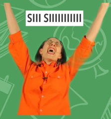.

Bue, en realidad no se trata estrictamente de el patrón compositor. Si fuese el
caso la encuesta padre tendría acceso a sus respectivas hijas pero no va a ser
así si no mas bien el caso inverso, solo las hijas van poder acceder a las
preguntas de sus padres.

Tal vez habría que limitar esta funcionalidad en razón de cuantos niveles de
anidamiento puede decender o usar un patrón como [prototype](https://refactoring.guru/design-patterns/prototype) y clonar la
encuesta por completo y añadirle las nuevas preguntas ?  ...emm si tal vez
...tal vez. Pero eso evitaría que si la encuesta original fuese actualizada
dicho cambio se propague hasta las encuestas clonadas y realmente no se si
queremos eso. Ademas si nos sobra tiempo podemos delegarle esa decisión al
usuario final: extender de la original o clonarla, para luego añadirle
preguntas.

Ok vamo a los bifes que se me acaba la noche y tenemos que entregar esta
delicia. Vamos a ver que onda el [diagrama](https://drive.google.com/file/d/1inr69H0FZIQSQHlcZ366PwIJ2fVi1r4J/view?usp=sharing) del modelo de domino !

Se puede apreciar que se hizo bastante esfuerzo en la síntesis de los elementos
(entidades) de este modelo. En otras palabras, no hay nada en este modelo que
no este abocado a la solución de los requerimientos.

Eso es muy importante por 2 razones principales: **la primera** es bueno... MVP
ameo, cuando se trabaja en un mínimo producto viable todo lo que no es
esencial para el funcionamiento del producto se posterga hasta que futuras
iteraciones del producto lo requieran. Y **la segunda** es que hoy es miércoles
16 de septiembre esta evaluación se entrega mañana a mas tardar y mientras
escribo estas palabras no tengo UNA SOLA LINEA DE CÓDIGO ESCRITA...NADA DE
NADA. Así que quien este leyendo esto imagínese que tengo que economizar
esfuerzos al super maximum infinitum o lo único que tendré para ofrecerle a
Alejandro va a ser un `hola mundo` (P.P)

Por suerte si cuento con varios apuntes de planeamiento que elabore el pasado
viernes, sábado y domingo.

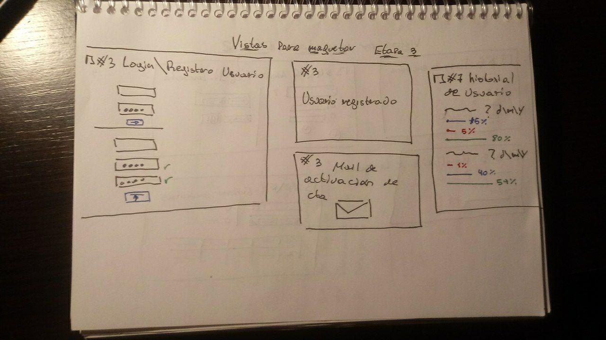 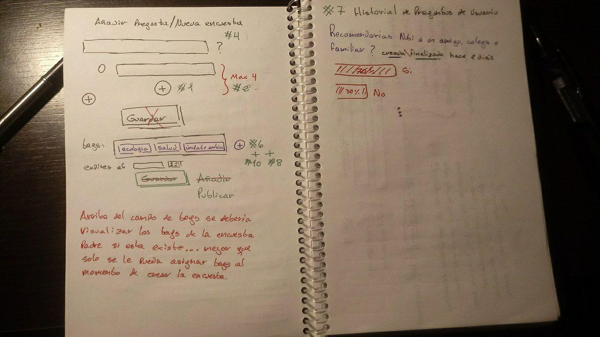
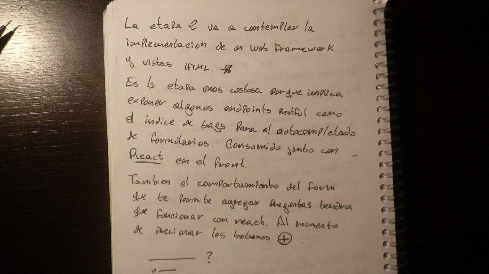 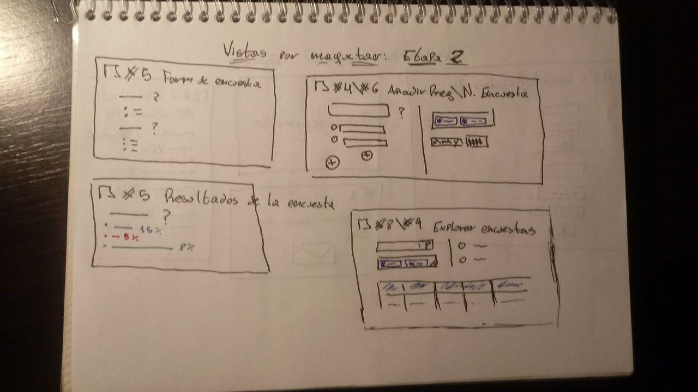
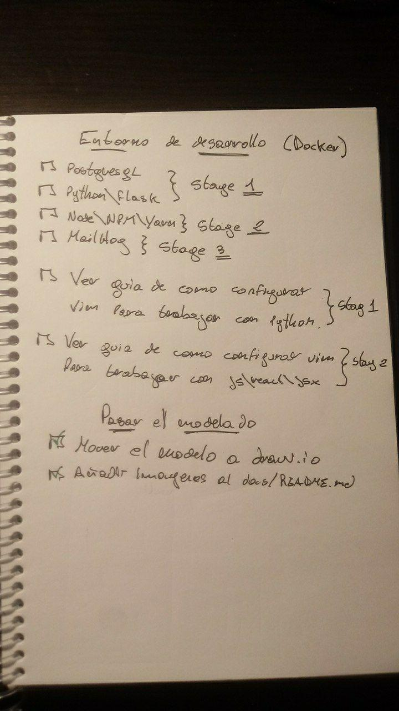 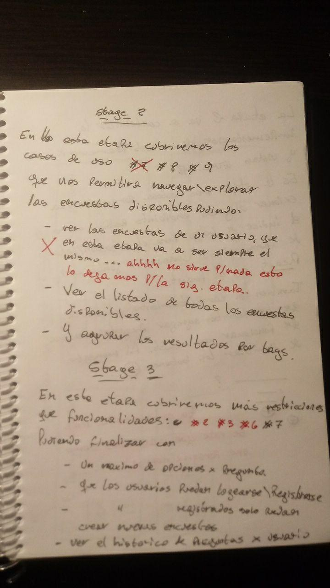 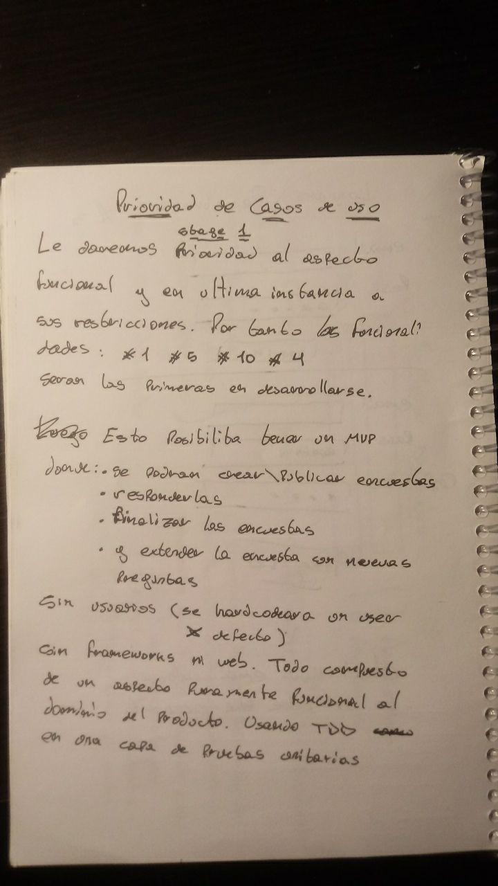
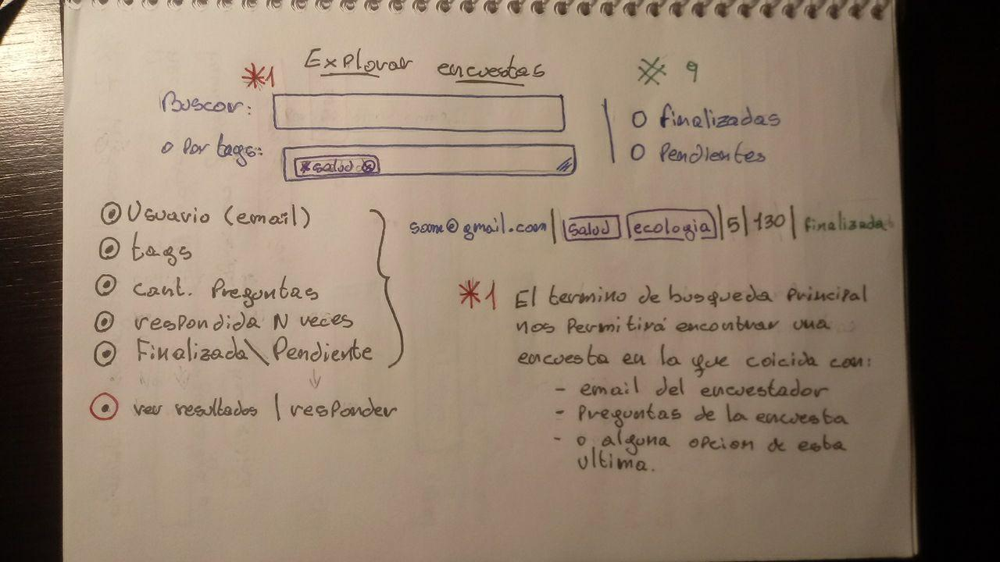 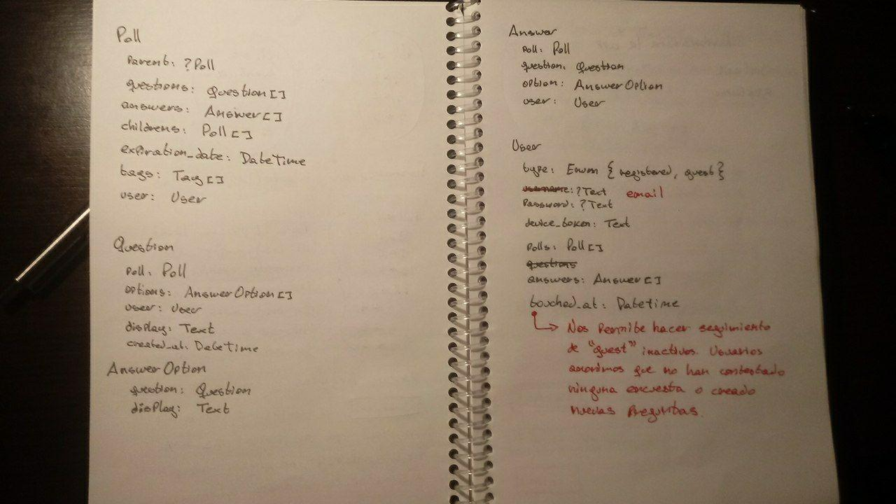
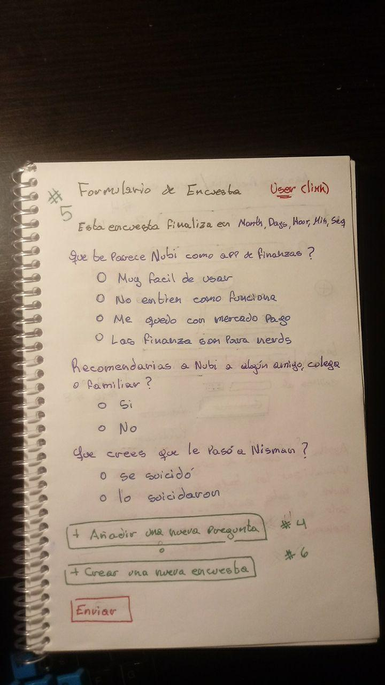 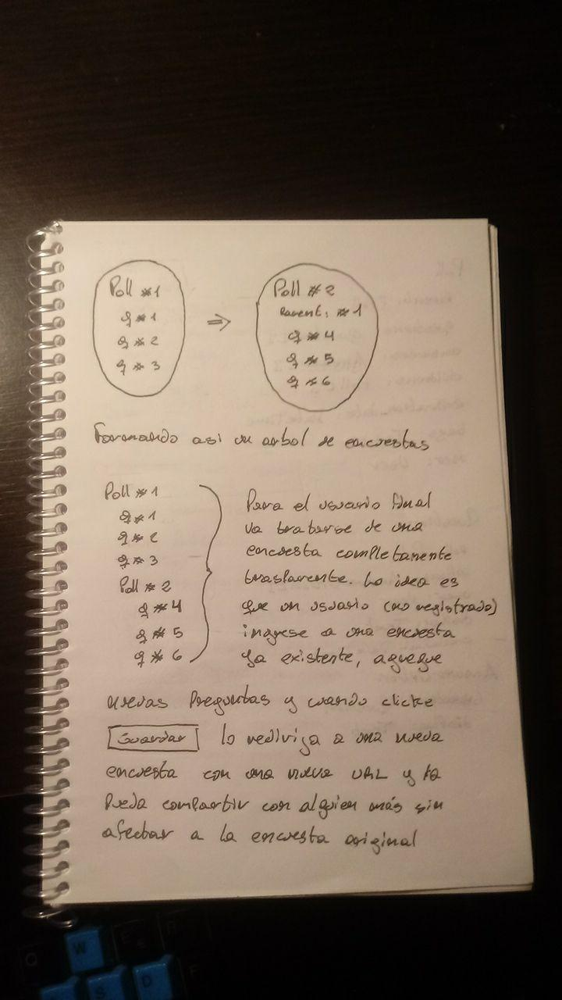 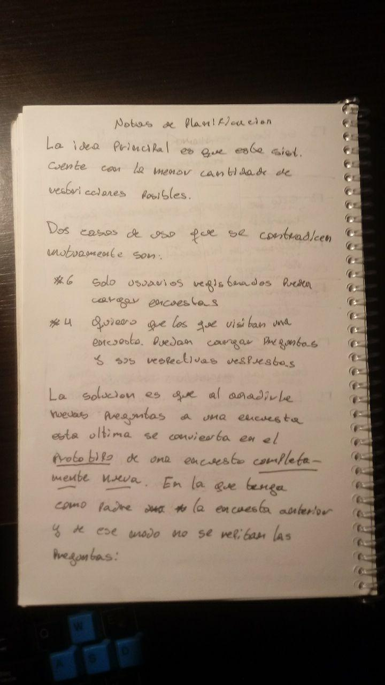

## Prioridad de Casos de Uso

El desarrollo de los dimiremos en 3 etapas que por hacerme el cheto las voy a
llamar **stages**

### Stage I

Le daremos prioridad al aspecto funcional y en ultima instancia a sus
restricciones. Por tanto los requerimientos **#1** **#4** **#5** **#10** serán
los primeros en desarrollarse logrando así que:

- Crear|publicar encuestas
- Responderlas
- Finalizar las encuestas
- Y extender la encuesta con nuevas preguntas

Si es posible no existirán usuarios en esta etapa o bien el producto funcionara
con un solo usuario haciendo todo los casos detallados mas arriba.
Sin frameworks ni web. Todo compuesto de un aspecto fuertemente funcional al
dominio del producto. Usando TDD en una capa de pruebas unitarias.

### Stage II

Aquí cubriremos los requerimientos **#8** **#9** haciendo posible navegar y
explorar las encuestas disponibles pudiendo:

- Ver el listado de todas las encuestas disponibles
- Y agrupar los resultados por etiquetas en los métodos de búsqueda

Para esta etapa si necesitaremos integrar flask y sqlalchemy a nuestro producto
para poder trabajar. Nuestro ambiente de docker inicial ya cuenta con un
contenedor para python y otro para postgresql.

Esta es la etapa mas costosa porque implica exponer algunos endpoints RESTful
como el indice de tags para el autocompletado de formularios. Dicho endpoint
sera consumido por el front por medio de react.

También el comportamiento del formulario que te permite agregar nuevas preguntas
tendrá que funcionar con react al momento de presionar el botón de **agregar
otra pregunta y agregar otra opción de respuesta a una pregunta**

### Stage III

En esta ultima etapa cubriremos mas restricciones que funcionalidades:

**#2** **#3** **\#6** **#7**. Pudiendo así finalizar con:

- Un máximo de opciones por pregunta
- Un mecanismo de autentificacion, sign in\sign up
- Que solo los usuarios registrados puedan crear encuestas
- Ver un histórico de preguntas por usuario

## Stages y Maketado de vistas

Durante el **Stage I** no nos encontraremos con maquetado de ningún tipo. Como
digimos mas arriba esta estapa esta dedicada al core de nuestro producto.
Entidades, sus estados y las acciones que representan la capa de servicios, sus
casos de uso por decirlo de alguna manera.

Durante el **Stage II** vamos a maquetar las vistas siguiendo los
requerimientos de estos mockups:
- [formulario de encuesta](docs/formulario de encuesta.pdf)
- resultado de la encuesta (con un diseño del [historial de preguntas del usuario](docs/historial de preguntas.pdf))
- [añadir pregunta - nueva encuesta](docs/añadir pregunta - nueva encuesta.pdf)
- [explorar encuestas](docs/explorar encuestas.pdf)

Por ultimo en el **Stage II** aboraremos el maquetado de las vistas
- login y registro de usuario
- vista de confimacion de usuario registrado
- cuerpo del email de confirmacion de cuenta del usuario
- [historial de preguntas del usuario](docs/historial de preguntas.pdf)
